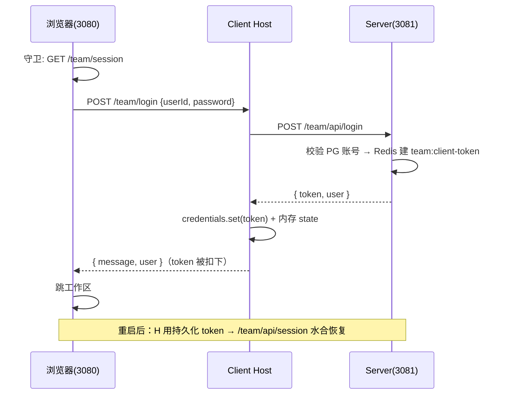
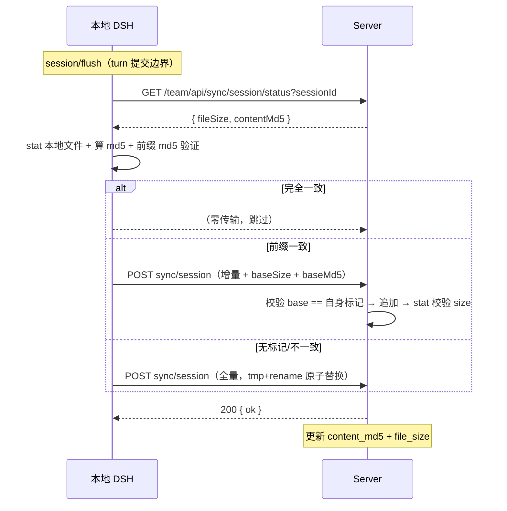

# DSH 团队平台 · 架构与技术方案详解

> 教学 + 备忘 + 讲解 + 自测 四合一
> 标签：#DSH #多租户 #架构设计 #同步 #认证隔离

---

## 0 · 使用说明（怎么用这份笔记）

- **第一遍**：按顺序读，重点在 2（概念直觉）和 4（端到端追踪）建立整体图景
- **复习**：过 3（系统地图）和 5（决策对比），看表格回忆细节
- **讲之前**：看 6（亮点讲法）和 8（推广解说）背话术
- **自测**：读完一节，合上笔记回答 9（自测题）——答不出才说明真没懂

---

## 1 · 项目目标与功能总览

**核心目标**：多员工本地 DSH → 一台服务器 DSH。服务器持有真密钥、识别每个用户、归档会话供分析。

**核心验收**：A/B 两台机器并发工作、互不可读互不可写对方会话；员工机器不持有真 DeepSeek key；服务器按用户归档会话。

**已实现功能**：
- ✅ 统一认证体系（管理员 Cookie + 本地 DSH Bearer；token 由 Host 托管）
- ✅ SSO 免密进后台（30 秒一次性 ticket 桥接）
- ✅ 模型网关（公司 token 换真 key、无缓冲流式转发）
- ✅ Session 归档同步（字节增量 + md5 校验 + 全量回退 + 对账）
- ✅ Git / 代码变更同步（监听工具执行，commit_hash 幂等）
- ✅ 管理后台（账号/分析/洞察/归属/同步状态/对账）
- ✅ 同步状态 UI（右下角胶囊，≥2s 动画 + 手动同步）
- 📋 代码分析面板（Step 2）

---

## 2 · 整体架构

### 拓扑

```
本地 DSH A/B（各员工机器）  →  服务器 DSH（唯一可信）
· workspace / shell / git     · 模型网关（token→真 key）
· 会话日志 / 公司 token        · 认证（PG + Redis）
                              · 会话归档（DSH 原生文件 + PG 索引）
                              · Git/代码变更记录
                              · 管理后台
```

### 分层视图

1. **存储层**：DSH 原生 session.jsonl.zstd 文件（真相）+ PG 派生索引
2. **同步层**：会话增量同步（md5 校验）· Git/变更上传 · 对账收敛
3. **接口层**：/team/api/*（机器，Bearer）· /team/admin/*（浏览器，Cookie）· /team/*（页面）
4. **认证层**：统一认证 · 凭证 Host 托管 · SSO ticket 桥接 · 三层隔离

---

## 3 · 端到端追踪（一次完整请求的生命周期）

> 这是理解整个系统最好的方式：一条线串起所有组件。面试讲故事也用它当骨架。

### 3.1 员工全流程（登录 → 干活 → 归档 → 分析）

```
① 打开 3080
   → 守卫脚本 → GET /team/session → 未登录 → 跳登录页
② 登录
   → 浏览器提交账号密码 → Host 转发 server → 校验 → 发 token
   → Host 拦截 token（credentials + 内存）→ 浏览器只见 user
   → 跳工作区
③ 干活（Agent 任务）
   → 模型请求：本地 llm → server 网关（token 换真 key）→ 流式返回
   → 工具执行：本地 bash/git/fs
④ turn 结束（session/flush）
   → 触发同步：拉 server 标记 → md5 比对 → 增量/全量 → server 校验 → 落盘 + 更新标记
⑤ commit 代码
   → tools/post-execute 检测 git → 上传操作 + diff stat（含 sessionId）
⑥ 管理员看后台
   → 使用分析/洞察/会话归属/同步状态（从 PG + 文件聚合）
```

### 3.2 登录时序图



### 3.3 同步时序图



---

## 4 · 核心概念直觉（用类比一次看懂）

### ① 文件即真相，DB 是目录卡
- **本质**：会话文件是唯一真相；数据库只是"目录卡"——记归属和进度，可随时从原件重建
- **类比**：书店的目录卡丢了，书架上的书还在；反过来书丢了，目录卡写什么都没用
- **反向回忆线**：目录卡 → DB 派生索引；书架上的书 → 会话文件
- **启示**：索引允许短暂不准，定期盘点（对账）让它和原件对齐

### ② 增量 + md5 = 只抄新页
- **本质**：追加式文件"新内容永远在末尾"；用"上次抄到的位置"当书签，只抄新长的部分
- **类比**：手账只往后写，抄过的位置做标记，下次只抄标记之后的新页
- **反向回忆线**：手账标记 → fileSize；验旧页没被改 → md5 前缀；验不过整本重抄 → 全量回退
- **安全**：抄前先验证"前面的页没被撕掉重写"（md5 指纹）

### ③ 对账 = 定期盘点
- **本质**：文件系统 + DB 无法原子，不追求"文件变了数据库立刻变"，定期扫描对齐
- **类比**：仓库盘点——清点货架（文件）→ 更新账本（DB）→ 账实不符就修正
- **启示**：对象存储（S3 桶清单）、事件溯源（日志→投影）的标准做法

### ④ Token 不进浏览器 = 管家保管钥匙
- **本质**：凭证由 Host 进程保管（credentials 文件 + 内存）；浏览器只见身份
- **类比**：管家替你保管家门钥匙，前台（浏览器）只知道"你住这"
- **为什么**：钥匙进前台 = 谁都能翻（devtools / 历史 / localStorage）

### ⑤ SSO Ticket = 电影票
- **本质**：机器身份 → 浏览器身份用"一次性短命凭证"桥接（30 秒、消费即删）
- **类比**：电影票——一次性、30 秒作废，捡到也进不了下一场
- **对比**：直接传 token = 把家门钥匙贴在门上（7 天有效）

### ⑥ 三层隔离 = 门卫 → 楼层门禁 → 房间钥匙
- **本质**：认证（你是谁）→ 存储约束（这层楼你进不去）→ 接口校验（这间房你没钥匙）
- **启示**：防御纵深，不是单一检查点

### ⑦ 幂等自愈 = 错了就整本重印
- **本质**：任何对不上 → 全量重传，替换天然幂等
- **启示**：正确性靠"验证 + 幂等 + 可重建"，不靠状态永远精确

### ⑧ 每次拉标记 = 每次问坐标
- **本质**：client 本地不记"同步到哪了"，每次同步前问 server 要坐标（fileSize+md5）
- **为什么**：本地内存崩溃即丢、压缩会重写文件；server 的标记是唯一权威

---

## 5 · 系统地图（防遗忘速查）

### 5.1 HTTP 端点总表

| 域 | 端点 | 鉴权 | 用途 |
|---|---|---|---|
| **Client 本地路由** | /team/login · /team/session · /team/enter · /team/logout | — | 员工登录态 |
| | /team/login-page | — | 本地登录页（React） |
| | /team/admin | — | SSO ticket → 跳 server 后台 |
| | /team/sync/status · /team/sync/now | — | 同步状态 / 手动触发 |
| **Server API**（机器，Bearer） | /team/api/login · /team/api/session | — / Bearer | 登录发 token · 水合 |
| | /team/api/model/chat/completions | Bearer | 模型网关 |
| | /team/api/sync/session · /sync/session/status · /sync/sessions | Bearer | 上传 / 拉标记 / 拉列表 |
| | /team/api/git/ops · /git/changes | Bearer | Git / 变更上传 |
| | /team/api/admin-ticket · /team/admin/consume | Bearer / — | SSO code 换发与消费 |
| **Server Admin**（Cookie） | /team/login · /session · /logout · /apply | — | 管理员登录态/申请 |
| | /team/admin · /users · /sessions · /analytics · /insights | admin | 后台页面与接口 |
| | /team/admin/sync-status · /sync/reconcile | admin | 同步状态 · 对账 |

### 5.2 PG 表 · Redis key · 事件 · 环境变量

| 类别 | 名称 | 字段 / 说明 |
|---|---|---|
| **PG 表** | team_users | 账号：id/email/name/status/role/password |
| | team_session_log | 归属+标记：session_id/user_id/content_md5/file_size |
| | team_audit_logs | 审计：level/event/source/user/session/details JSONB |
| | team_git_ops | Git 操作流水：action/cwd/failed/user/session |
| | team_code_changes | 代码变更：commit_hash UNIQUE（幂等键） |
| | team_session_owners | 旧归属表（遗留） |
| **Redis** | team:session:* | 管理员 Cookie（7 天滑动） |
| | team:client-token:* | 本地 DSH Bearer（7 天固定） |
| | team:admin-ticket:* | SSO 一次性 code（30 秒） |
| **事件** | session/created · flush · disposed | 同步触发（flush=提交边界） |
| | tools/post-execute | Git 抓取（水瀑，必须 next()） |
| | credentials/reference-updated | 登录/登出 → 补传 |
| **环境变量** | TEAM_ROLE · TEAM_SERVER_URL | 角色 / server 地址 |
| | DB_URL · REDIS_URL | server 的 PG / Redis |
| | TEAM_SESSIONS_ROOT | server 会话根（单机隔离） |
| | DEEPSEEK_API_KEY | server 真密钥（只 server 内 resolve） |

---

## 6 · 功能详解

### 6.1 认证与登录

两类消费者 × 两套认证：机器要可携带的 Bearer，浏览器要自动携带的 Cookie——**不合并**。

| 机制 | 载体 | Redis key | 生命周期 | 消费者 |
|---|---|---|---|---|
| 机器认证 | Bearer token | team:client-token:* | 固定 7 天 | 本地 DSH |
| 浏览器会话 | HttpOnly Cookie | team:session:* | 滑动续期 | 管理员 |
| SSO 桥接 | 一次性 code | team:admin-ticket:* | 30 秒、消费即删 | 浏览器跳转 |

**细节**：token 被 Host 拦截（credentials + 内存）；重启水合免重登；登出全链路。

### 6.2 模型网关

```
本地 llm-deepseek → 网关校验 Bearer → 换真 key → 流式转发
(apiKeyEnv=TEAM_COMPANY_TOKEN)  (Redis→userId)  (server 内 resolve)  (无缓冲/10min/50MB)
```

**最小侵入**：本地 Agent Loop / 工具 / 流式行为零改动，只改配置层。

### 6.3 Session 归档同步

```
① 拉 server 标记 → ② 本地算 md5 → ③ 决策（跳过/增量/全量）→ ④ 上传 → ⑤ 更新标记
```

**触发**：session/flush（主）· created · disposed · 挂载/登录补传。每会话单飞锁。

**对账**：PG 有行文件无→删；文件有 PG 无→孤儿；标记不符→以文件重建。启动自动 + 手动。

### 6.4 Git / 代码变更同步

```
监听 tools/post-execute → 检测 bash + git → commit 成功 → rev-parse + diff-tree --shortstat → 上传
```

**细节**：水瀑必须 next()；只传元数据；commit_hash UNIQUE 幂等；sessionId 已关联。

---

## 7 · 决策对比总表（为什么不用 X）

> 面试官最爱问对立面。这张表是"为什么选 Y"的弹药库。

| 决策 | 选 Y | 为什么不用 X | 代价/注意 |
|---|---|---|---|
| 会话存储 | 文件为真相 + DB 派生索引 | 不用"DB blob 为真相"：文件是官方格式，可重放/版本化，DB 只是查询面 | 索引会漂移 → 对账兜底 |
| 同步粒度 | 字节增量 + md5 | 不用"整文件上传"：O(n²) 带宽 | 需要前缀校验保证安全 |
| 进度标记 | md5（内容级精确） | 不用 size+mtime：可能漏判压缩重写 | 需读文件算哈希（本地便宜） |
| 位置来源 | 每次拉 server 标记 | 不用本地记：内存崩溃即丢、压缩重写弄脏 | 每次多一次 GET（小） |
| 会话凭证 | Redis 服务端会话 | 不用 JWT：JWT 无状态但撤销要黑名单 | 需 Redis 可用 |
| 两套认证 | Bearer + Cookie 分治 | 不合并：合并=token 暴露或嗅探调用方 | 多维护一套 |
| 跨边界凭证 | 30 秒一次性 code | 不用 token 直传：泄露窗口 7 天 vs 30 秒 | 多一跳往返 |
| 一致性 | 写路径尽力 + 对账 | 不用事务强一致：文件系统 + DB 无法原子 | 短暂漂移可接受 |
| 并发控制 | 每会话单飞锁 | 不用消息队列：单一写入者，锁就够 | 最坏 409 → 全量 |
| 密码存储 | scrypt（计划中） | 当前明文是 MVP 取舍 | 后置，识别了风险 |
| 真密钥 | server 内 resolve | 不用下发给员工机器 | 网关是唯一出口 |

---

## 8 · 技术亮点 · 讲法手册

### 亮点 1：文件即真相，DB 是派生索引
- **怎么说**："会话原始日志（官方 DSH 格式）作为真相存文件，PG 只存归属和同步标记——标记能从文件重算。文件系统和数据库没法原子，所以写路径尽力同步 + 对账兜底，这是对象存储和事件溯源的通用模式。"
- **追问**：索引漂移怎么办？→ 对账：启动自动 + 后台手动。

### 亮点 2：md5 校验的字节增量
- **怎么说**："文件是追加式的，新内容永远在末尾。client 每次先拉 server 的标记（位置+指纹），本地算前缀 md5 验证没被重写，一致就只传新增字节；server 收到再用 baseMd5 校验。整个系统没有游标、没有 seq 连续性校验——复杂度从'状态对齐'降级为'内容验证'。"
- **追问**：为什么是 md5 不是 size+mtime？→ 内容级精确；内容指纹非秘密，无盐。

### 亮点 3：幂等自愈
- **怎么说**："全量上传是原子替换（tmp + rename），重复传同样的内容结果不变。断网、重启、并发、版本不匹配——每个异常路径都收敛到正确状态。"
- **追问**：并发两次同步？→ 每会话单飞锁 + server 409 兜底。

### 亮点 4：Token 永不进浏览器
- **怎么说**："登录时服务器返回的 token 被本地 Host 拦截保存，浏览器只收到用户信息。token 不会出现在 devtools、浏览器历史、localStorage——泄露面最小。重启后 Host 用持久化 token 水合恢复。"
- **追问**：为什么要这样？→ token 进浏览器 = 钥匙放前台。

### 亮点 5：SSO 短命 code 桥接
- **怎么说**："员工点'进后台'，Host 拿 token 换一次性 code，浏览器带 code 跳服务器消费，服务器种 Cookie。code 只能换一个新会话、30 秒过期、消费即删——泄露窗口从 7 天缩到 30 秒，OAuth2 authorization code 同款。"
- **追问**：为什么不直接传 token？→ 长命凭证过浏览器边界 = 钥匙贴门上。

### 亮点 6：模型网关凭证代换
- **怎么说**："本地 DSH 用公司 token 调网关，服务器校验身份后换成真 DeepSeek key 转发。员工机器上没有任何真实 API key——即使整台机器被盗也拿不到模型凭证。"
- **追问**：流式体验？→ 无缓冲转发，客户端零感知。

### 亮点 7：隔离靠数据库约束，不靠信任
- **怎么说**："会话归属用 DB 约束保证：ON CONFLICT DO UPDATE WHERE user_id 匹配——会话已被别人绑定，你的写入直接失败。查询层按 userId 过滤，接口层再校验，三层纵深。"
- **追问**：隔离在哪几层？→ 存储（约束）→ 查询（过滤）→ 接口（鉴权）。

### 亮点 8：fail-closed 版本门控
- **怎么说**："上传时校验 header.version 与 SESSION_FORMAT_VERSION，不一致返回 415。新格式客户端不会写坏老服务器，升级是明确的 fail-closed。"
- **追问**：升级怎么办？→ 两端一起升级，格式由 DSH 单方面拥有。

---

## 9 · 演进与踩坑记录

### Session 同步三版迭代

- **v1 增量事件 + seq 游标 + 连续性校验** → 复杂度爆炸：游标跨根失效、压缩产生合法 seq 空洞被拒、失败丢批次导致无限 gap 刷屏、崩溃窗口重复追加
- **v2 整文件上传** → 简单正确，但 O(n²) 带宽
- **v3 md5 校验的字节增量（最终）** → 日常 O(增量)，异常回退全量；内容验证取代状态机

### 六个关键踩坑

| 坑 | 教训 |
|---|---|
| PowerShell ANSI 读 UTF-8，中文注释吞换行 → env 加载失败 | 配置避免非 ASCII 注释；脚本显式 -Encoding UTF8 |
| tsdown 打包 devDeps → 值导入拉进 @Remote 装饰器 → Node 解析炸 | 运行时依赖放 dependencies（外部化） |
| patch 的 disabled 禁用被覆盖的目标行本身 | patch 字段直接覆盖目标行；守卫放表达式内 |
| 换根后 PG 标记指向旧根 → 补传全跳过 | 标记是派生的，换根必须对账或重置 |
| 坏文件让 sessionController.list() 抛错 → 分析 400 | 端点容错降级 + 对账清理 + size 校验 |
| grep -c "error" 匹配不到 ERROR → 假"构建通过" | node --check + 正确 tsc grep |

---

## 10 · 自测题（合上笔记回答）

### 概念层（能推出机制吗）
1. 为什么"文件变了数据库不用立刻变"？（提示：手账/目录卡）
2. 增量同步的"书签"是什么？什么情况下书签会失效？（fileSize；压缩重写 → 前缀 md5 检测）
3. 为什么 ticket 比 token 安全？类比是什么？（电影票 vs 钥匙贴门上）

### 机制层（能讲清流程吗）
4. 一次同步的五个步骤是什么？每步防什么？
5. token 在哪些地方出现、哪些地方绝不出现？
6. 三层隔离分别在哪层、用什么机制？

### 决策层（能回答"为什么不用 X"吗）
7. 为什么不用 JWT？为什么不用整文件上传？为什么不用 size+mtime？
8. 为什么两套认证不合并？合并会怎样？

### 陷阱层（能说出坑吗）
9. 换根后为什么同步会"全跳过"？怎么修？
10. 为什么一个坏文件能拖垮整个分析端点？防御是什么？

> 答不上来的题 = 你还没真正掌握的点，回对应章节再看一遍。

---

## 11 · 推广解说脚本（demo 话术）

**Step 1 · 开场**："这是一个团队 AI 工作台：每个员工本地跑自己的 DSH，一台服务器做统一认证、模型代理和会话归档。核心理念——机器在员工手里，信任和数据边界在服务器。"

**Step 2 · 登录**："员工用公司账号登录。注意：token 从不进浏览器——它被本地 Host 拦截保存，浏览器只拿到身份信息。重启后自动恢复登录。"

**Step 3 · 干活 + 模型网关**："模型请求走服务器网关——服务器校验 token 后换成真密钥，员工机器上永远没有真实 API key。流式输出完全无感。"

**Step 4 · 会话同步**："点右下角'手动同步'看效果：每次触发至少 2 秒同步动画。技术上只传新增的尾部字节，md5 指纹验证，对不上就整文件重传——正确性永远兜底。"

**Step 5 · Git 追踪**："员工 commit 时服务器自动记录操作和改动统计——为代码分析打基础。"

**Step 6 · 管理后台**："管理员看分析/洞察/归属/同步状态。注意隔离：员工之间互相看不到对方会话——数据库约束保证，不是靠自觉。还能手动对账。"

**Step 7 · 收尾**："过程（会话）、行为（Git）、结果（代码变更）三层数据都沉淀到服务器；安全和隔离是架构层的，不是事后补丁。"

---

## 12 · 面试问答

**Q: 为什么文件是真相，数据库只是索引？**
A: 会话文件是官方持久化格式，可重放、版本化；PG 的标记可从文件重算。文件系统 + 数据库无法原子，所以「写路径尽力 + 对账收敛」——对象存储/事件溯源通用模式。

**Q: 为什么用 md5 不用 size+mtime？**
A: size+mtime 可能漏判「同大小同 mtime 内容变了」（压缩重写）。md5 内容级精确。注意：这里是内容指纹不是秘密，不加盐；加盐是密码哈希概念，且会破坏对账重算比对。

**Q: 增量同步怎么保证不损坏？**
A: 三重校验：① client 增量前 md5 证明前缀一致；② server 用 baseSize+baseMd5 与自身标记比对；③ 追加后 stat 校验大小 == totalSize。任何失败 → 409 → 全量替换（幂等）。

**Q: 为什么 token 不进浏览器？两套认证为什么不合并？**
A: token 进浏览器 = 暴露在 devtools/历史/localStorage。合并 = 浏览器拿 token（违反底线）或嗅探调用方（脆弱）。机器要 Bearer、浏览器要 Cookie，是两类消费者的交付方式不同。

**Q: 为什么用 SSO ticket 而不是直接传 token？**
A: 长命 token 跨边界泄露窗口 7 天；30 秒一次性 code 泄露即废、用途单一、消费即删——OAuth2 authorization code 标准做法。

**Q: 数据隔离落实在哪几层？**
A: 三层：存储（DB 归属约束）→ 查询（userId 过滤）→ 接口（Bearer→userId→归属校验，403/404 区分）。

**Q: 为什么不用 JWT？**
A: Redis 会话可服务端撤销、可滑动续期、O(1) 校验；JWT 无状态但撤销要黑名单，复杂度转移。

**Q: 100 人并发的性能怎么保证？**
A: 提交边界触发（低频）+ 每批 O(增量) + 每会话单飞锁；server 每批 = Redis 鉴权 + 两次 PG + 追加写盘。早期"每次全量解码"有 O(n²) 问题，改游标缓存后消除。

**Q: 已知的取舍/风险？**
A: 密码明文、token 未哈希、禁用不即时生效——都识别了，按 MVP 后置。演进方向：scrypt、token sha256、网关校验 status、双 token（受官方适配器 401 重试限制）。

---

## 13 · 未来路线

- 📋 **代码分析面板**：项目/用户/趋势统计 + 会话↔提交关联（Step 2）
- 🔒 **安全加固**：scrypt 密码哈希 · token sha256 · 禁用即时生效 · 登录限流
- 🔒 **Access/Refresh 双 token**：30min + 7d + 轮换
- 🔒 **多设备管理**：deviceId + 设备列表/远程撤销
- 🚀 **diff 内容分析**：经验沉淀、代码审查、项目记忆
- 🚀 **报表/仪表盘**：从结构化数据层做团队报表
